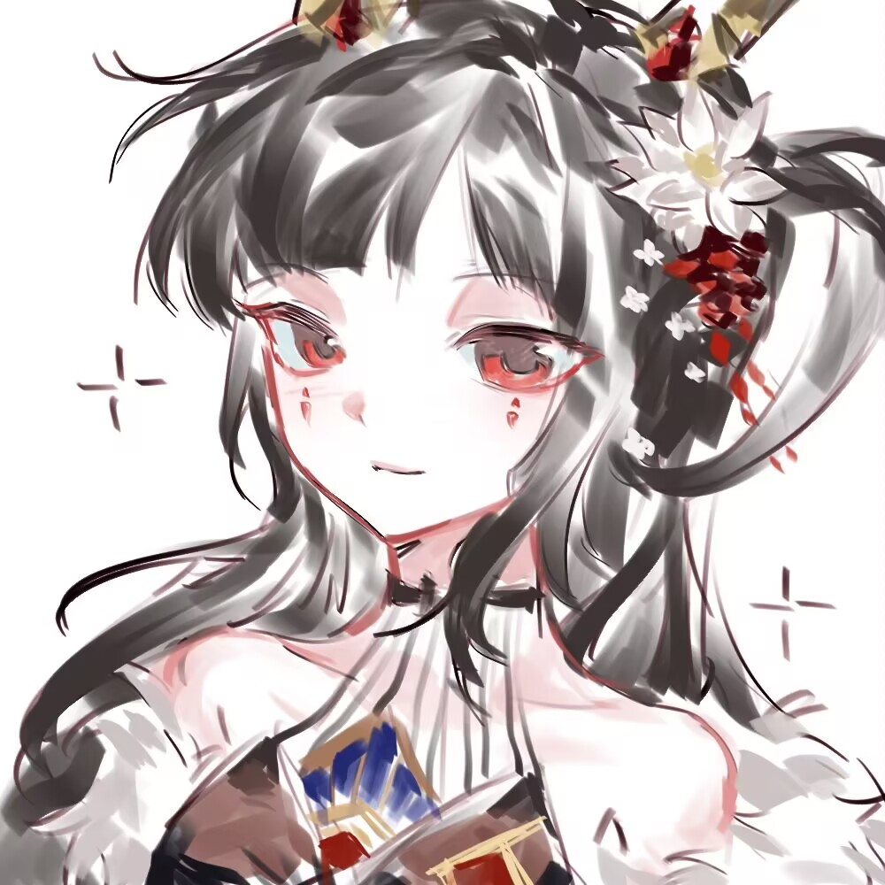

# 🏆 贡献与鸣谢 (Contribution)

**Mizuki Bot** 的诞生与成长离不开以下成员的辛勤付出。

  <!-- HX-Wrdzgzs -->
  

    
    
HX-Wrdzgzs

    
核心开发者 维护与文档

  

  <!-- Te:River (已修正) -->
  

    <!-- 注意：图片文件名也改成了 TeRiver.jpg -->
    
    
Te:River

    
技术支持 服务保障

  

  <!-- Sirius -->
  

    
    
Sirius

    
硬件支持 底层架构

  

  <!-- ecomter -->
  

    
    
ecomter

    
硬件支持 底层架构

  

  <!-- 公良寻竹 -->
  

    
    
公良寻竹

    
美术设计 初代头像绘制

  

 
 

## 💖 开源致谢

本项目同时也使用了以下优秀的开源项目与服务：

*   **Framework**: NoneBot2 / Koishi / go-cqhttp
*   **Data Source**: ぷろせかもえ！ / 33Kit
*   **Design**: 小沢翼 (Logo) / Foglio (UI)

---
*Created with ❤️ by HX-Wrdzgzs*
